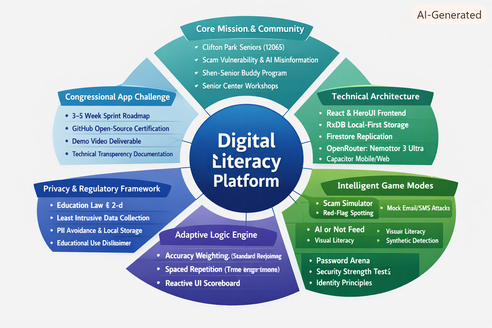

# **Technical Specification & Project Overview: 2026 Congressional App Challenge**

## **1\. Executive Mission & Community Context**

In the rapidly evolving digital landscape of the Shenendehowa/Clifton Park area, the elderly population faces an escalating volume of sophisticated threats that exploit a critical digital literacy gap. As a strategic intervention, this platform bridges the generational divide by transforming a global epidemic of cybercrime into a manageable, community-driven mission. By focusing on the tension between advancing AI-driven misinformation and current technical limitations, the system provides a consequence-free environment where seniors can build the resilience necessary to navigate modern technology with confidence.

### **Community Risk vs. Technical Intervention**

| Community Risk | Technical Intervention |
| :---- | :---- |
| **High Vulnerability:** Targeted "grandchild in trouble" alerts and fake utility notices. | **Safety Drills:** Users practice "Red-Flag Spotting" within synthetic, AI-generated mock scenarios. |
| **AI Misinformation:** Difficulty distinguishing between real community photos and synthetic content. | **Visual Literacy Training:** An "AI or Not" feed trains users to identify synthetic content using community-specific imagery. |
| **Privacy Concerns:** Fear of data breaches regarding sensitive Personally Identifiable Information (PII). | **Local-First Architecture:** Performance logs and user data remain on-device via RxDB to ensure uncompromising privacy. |
| **Isolated Learning:** Limited access to support tailored for the 12065 zip code. | **Intergenerational Mentorship:** Direct support via the "Shen-Senior Buddy" network at local landmarks like the Town Park. |

**Strategic Objective: To safeguard the seniors of the Shenendehowa community by providing an accessible, AI-enhanced simulation environment that builds digital resilience within the 12065 zip code.**

This community mission dictates the selection of a specific technical stack designed to prioritize high-speed performance and zero-cost backend constraints.

## **2\. Technical Architecture & Strategic System Stack**

The selection of a "Local-First" architecture is a strategic decision intended to balance a high-performance user experience with uncompromising senior privacy. By prioritizing on-device processing, the system remains functional regardless of intermittent connectivity in local parks or community centers while keeping backend costs at zero.

### **The Stack Breakdown**

1. **Frontend (React & HeroUI):** These frameworks ensure accessibility through high-contrast components. Utilizing HeroUI’s "beautiful by default" library is a significant project management win, as it dramatically reduces CSS overhead during the 3-5 week development sprint.  
2. **Environment (Bun & Capacitor):** Bun is utilized to accelerate the development-test-deploy cycles. Capacitor enables cross-platform deployment to iOS, Android, and Web from a single codebase, satisfying the diverse device requirements of the senior community.  
3. **Data Layer (RxDB):** This choice prioritizes the privacy of the elderly by keeping performance logs on-device. It allows the system to operate as a robust, offline-capable tool with a native application feel.  
4. **AI Integration (OpenRouter/Nemotron 3 Ultra):** The platform utilizes a multi-stage synthetic content pipeline. To ensure quality, a **Generator** LLM creates the scam content, an **AI Critic** loop evaluates the scenario for difficulty, and a **Human-in-the-loop** (Digital Mentor) provides final approval via a HeroUI dashboard.

This stack is governed by a data schema designed for high-performance tracking without data harvesting.

## **3\. Database Architecture & Privacy-First Schema**

The system utilizes a four-table RxDB schema to support intelligent game logic while strictly adhering to a "Least Intrusive Data Collection" policy. This structure supports an adaptive engine while keeping data local.

### **The Four-Table Design**

1. **profiles:** Stores anonymous "Safety Scores," cumulative drills completed, and accessibility preferences (e.g., high-contrast mode, text scale).  
2. **scenarios:** A library of mock emails, texts, and phone scripts. These are updated via Firestore replication to ensure the platform reflects current scam trends.  
3. **game\_stats (shield\_logs):** This table tracks performance metrics including `mode_id`, accuracy scores, and the `last_practiced_timestamp`. These fields allow the system to identify struggle areas without uploading user behavior to the cloud.  
4. **community\_events (lifeline\_contacts):** Contains local workshop schedules and a dashboard featuring one-tap emergency contacts for trusted Clifton Park authorities or family members.

   ### **Data Flow Analysis**

The system utilizes Firestore replication to sync new content via reactive queries ($). This allows the team to push new "trending" scams to the `scenarios` table in real-time. Because RxDB maintains the primary data on the device, the replication process remains one-way for content updates, ensuring that user performance data and PII never leave the local environment.

This structured data is transformed into the platform’s core interactive learning modes.

## **4\. Intelligent Game Modes & Adaptive Learning Logic**

The strategic implementation of "Safety Drills" provides a consequence-free environment for experiential learning. Gamification is used here for cognitive reinforcement, transforming abstract security concepts into tangible challenges.

### **The Core Simulations**

* **The Scam Simulator:** A "Guess Game Style" mechanic where users view mock emails. They must identify and tap specific "Red Flags"—such as urgent, threatening tones or mismatched sender addresses—to earn points.  
* **"AI or Not" Feed:** This interactive feed trains visual literacy by presenting a mix of real community photos and synthetic, AI-generated content. Users must flag synthetic images to build awareness of modern misinformation.  
* **Password Arena:** An evaluator logic that teaches secure digital identity principles. Users rate various passwords as "Weak," "Medium," or "Strong," receiving immediate feedback on security best practices.

  ### **The Adaptive Recommendation Engine**

To prevent knowledge decay, the backend engine employs a two-fold logic:

* **Performance-Based Weighted Probability:** The system calculates the **Standard Deviation** of scores across all modes. It identifies the user's weakest performance areas and assigns them a higher probability weight, ensuring difficult lessons are naturally repeated.  
* **Spaced Repetition:** The app monitors the `last_practiced_timestamp` for each `mode_id`. If a specific mode has not been engaged within a 7-day interval, the **Time-Delay Penalty** logic automatically prioritizes it on the dashboard to prevent skill attrition.

These sophisticated features are protected by a deliberate regulatory and privacy framework.

## **5\. Regulatory Strategy & Privacy Framework**

The system follows a strategic compliance path that leverages target demographics to bypass the bureaucratic hurdles of traditional educational software.

### **Regulatory Analysis**

| Feature | Standard Educational Apps | This System |
| :---- | :---- | :---- |
| **Target Audience** | Students (EDN § 2-d) | Seniors / Elderly Population |
| **Legal Status** | Third-Party Contractor | Community Educational Tool |
| **Regulatory Burden** | Requires District Contracts & Parents Bill of Rights | Rapid Community Deployment |
| **Definition of "Student"** | Persons attending/enrolling in an educational agency | **N/A** (Targeting non-student residents) |

By targeting seniors rather than "Students" (defined by Education Law § 2-d as persons "attending or seeking to enroll in an educational agency"), the platform does not function as a "Third-Party Contractor" to an "Educational Agency." This allows the team to deploy rapidly at the Clifton Park Senior Center without the administrative delays of school board contracts.

### **Privacy Protections**

The privacy strategy is built on three pillars:

1. **PII Avoidance:** No personally identifiable information is collected or stored.  
2. **Local-Only Storage:** Using RxDB ensures that performance logs tracking specific user struggles remain strictly on the user's device.  
3. **Mandatory "Not a Monitor" Clause:** To ensure legal clarity, the app includes the following disclaimer: *"This application is for educational purposes only and does not actively monitor, block, or filter real-world phone calls, emails, or digital communications."*

This professional regulatory stance facilitates broad community adoption.

## **6\. Community Integration & Intergenerational Mentorship**

The "Shen-Senior Buddy" program transforms the platform into a sustainable community initiative. This human-centric layer ensures that technical innovation is backed by interpersonal support.

### **Mentorship Mechanics**

1. **Digital Mentors:** Members of the Shenendehowa Computer Science Club and Science National Honor Society act as facilitators, requiring no prior coding knowledge for their role.  
2. **Community Workshops:** Mentors host "Digital Safety Days" at the Clifton Park Senior Center and local landmarks like the Town Park.  
3. **App Facilitation:** Mentors guide residents through the "Red Flag" identification process, helping them translate app-based scores into real-world confidence.

   ### **Success Metrics**

* **Congressional Certification for Open Source:** A technical validation milestone requiring high standards for GitHub documentation and code transparency.  
* **Safety Score Improvement:** Quantifiable growth in user digital resilience metrics stored within the local profile.  
* **Community Reach:** Targeted engagement and safety drill completion rates within the 12065 zip code.

  ## **7\. Development Roadmap & CAC Strategy**

The 3-5 week development sprint is designed to meet the rigorous quality standards of the Congressional App Challenge (CAC), emphasizing both technical depth and community impact.

### **The 5-Week Sprint Plan**

* **Weeks 1-2: Core Development:** Implementation of the RxDB schema and HeroUI "Scam Simulator" templates.  
* **Week 3: AI Integration:** Development of the synthetic scam generation pipeline and the Nemotron 3 Ultra "Critic" loop.  
* **Week 4: Backend Sync:** Finalizing Firestore replication to push new scam scenarios to devices in real-time.  
* **Week 5: Launch & Outreach:** Conducting workshops at the Clifton Park Senior Center and engaging local media outlets including The Daily Gazette (Your Clifton Park) and Saratoga Today.

  ## **8\. Future Branding Options (Team Deliberation)**

While the platform is currently referred to by functional terms, the following options have been curated for a final team vote to establish a permanent brand identity.

### **Professional/Direct**

* **SilverShield**  
* **ScamShield Shen**  
* **Senior CyberGuard**  
* **TechWise**  
* **EasyClick**

  ### **Educational/Empowering**

* **PathPilot: Digital Safety**  
* **Digital Resilience Lab**  
* **Safety Scoreboard**  
* **TechBridge**  
* **BrightSteps**

  ### **Community-Focused**

* **Shen-Senior Buddy**  
* **The 12065 Shield**  
* **Clifton Click**  
* **ShenConnect**  
* **Clifton Park CyberLink**